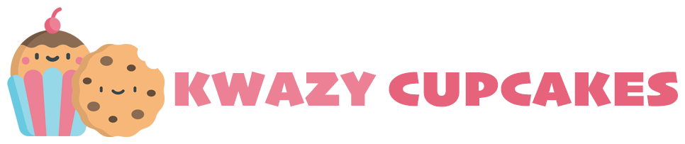
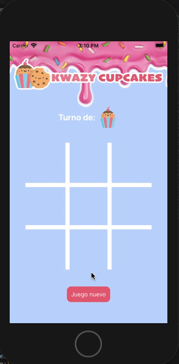

# Tic tac toe - Kwazy Cupcakes 

## 1. Juego 🕹️

Tic-tac-toe, Gato, La Vieja, Tres en línea o cómo lo llamen en tu país, es un juego clásico que todos hemos jugado. 

'Kwazy Cupcakes' es una versión deliciosa de tic-tac-toe, inspirada en el juego ficticio que aparece en la serie de ['Brooklyn 99'](https://brooklyn99.fandom.com/wiki/Kwazy_Kupcakes) para todo público.

## 2. Resumen del proyecto 👷🏼‍♀️

La App está desarrollada en React Native, para todos los sistemas operativos móbiles (iOS y Android.)

## 3. Link de la App 📱

Puedes encontrar la app publicada en Expo en el siguiente [link](https://expo.io/@bdiniscia/scl012-tic-tac-toe)

## 4. Flujo de la App 🧁🍪

- En caso de algún ganador: 

- En caso de empate: 

- Para empezar un juego nuevo: 

## 5. UI 

* [x] Muestra grilla (grid) de 3x3
* [x] Muestra jugador al que le toca su turno
* [x] Permite marcar cajita vacía
* [x] Cambia el turno después de marcar cajita
* [x] No permite marcar cajita ya marcada
* [x] Permite reiniciar la partida
* [x] Detecta jugadas ganadoras en eje x
* [x] Detecta jugadas ganadoras en eje y
* [x] Detecta jugadas ganadoras en diagonales
* [x] Muestra jugador ganador cuando gana
* [x] Muestra jugada ganadora cuando hay ganador
* [x] Muestra empate cuando nadie gana y no quedan cajitas que marcar
* [x] Permire volver a empezar cuando termina una partida (alguien ganó o empate)
