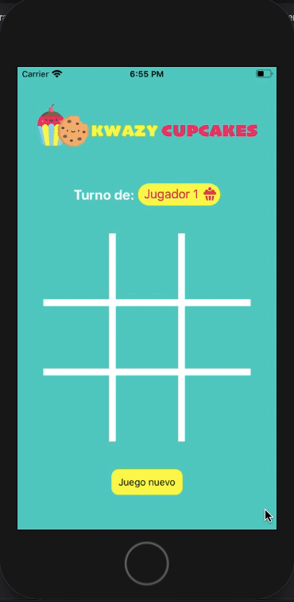

# Tic tac toe - Kwazy Cupcakes 

## 1. Juego 🕹️

Tic-tac-toe, Gato, La Vieja, Tres en línea o cómo lo llamen en tu país, es un juego clásico que todos hemos jugado. 

'Kwazy Cupcakes' es una versión deliciosa de tic-tac-toe, inspirada en el juego ficticio que aparece en la serie de ['Brooklyn 99'](https://brooklyn99.fandom.com/wiki/Kwazy_Kupcakes)

## 2. Resumen del proyecto 👷🏼‍♀️

La App está desarrollada en React Native, para todos los sistemas operativos móbiles (iOS y Android.)

## 3. Link de la App 📱

Puedes encontrar la app publicada en Expo en el siguiente [link](https://expo.io/@bdiniscia/scl012-tic-tac-toe)

## 4. Flujo de la App 🧁🍪

- En caso de algún ganador: 

- En caso de empate: 

- Para empezar un juego nuevo: 

